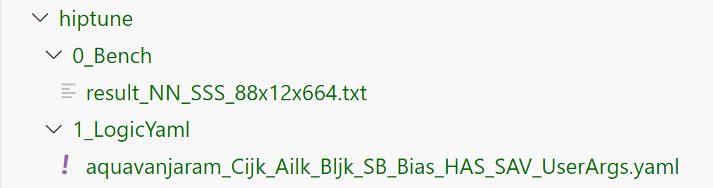

.. meta::
   :description: A library that provides GEMM operations with flexible APIs and extends functionalities beyond the traditional BLAS library
   :keywords: hipBLASLt, ROCm, library, API, tool

.. _how-to-use-hipblaslt-tuning-utility:

********************************
Using the hipBLASLt Tuning Utility
********************************

hipBLASLt has a simple utility that uses the existing kernel pools and searches for the best solution for a given problem size.

The template.yaml file
=================================

The ``template.yaml`` file can be found in the ``utilities`` directory.

.. code-block:: yaml

    # Two steps, can comment out Bench or CreateLogic if you want to disable.
    Bench:
    ProblemType:  # Same as the given problem type
        ComputeDataType: s
        ComputeInputDataType: s  # Usually the same as DataTypeA and DataTypeB unless you are using mix precisions.
        DataTypeA: s
        DataTypeB: s
        DataTypeC: s
        DataTypeD: s
        TransposeA: 0
        TransposeB: 0
        UseBias: False
    TestConfig:
        ColdIter: 20
        Iter: 100  # You can change this to a larger value for a more stable result, but the executing time also increases.
        AlgoMethod: "all"  # Fixed value
        RotatingBuffer: 512  # It's recommended to set this value larger than the cache size of the GPU.
    TuningParameters:
        # SplitK list control parameter example
        # SplitK: [0, 4, 8]  # [0] For disable
    ProblemSizes:
    - [128, 128, 128]  # M, N, K
    CreateLogic: {}  # Fixed

Running the tuning utility
=================================

The ``find_exact.py`` file is found in the ``utilities`` directory.

Follow these steps to run the tuning:

1. Run ``./install.sh`` first. See :ref:`installation` for more details.
2. Ensure the ``MatchTable.yaml`` file exists in ``build/release/library``.
3. Run the command ``python3 find_exact.py <your yaml file> <hipblaslt_root_folder>/build/release <output folder>``

You should see the following message appear. The following example is for NN FP32 tuning:

.. code-block:: bash

    Running benchmarks
    --Running size: result_NN_SSS_128x128x128.txt

After the tuning completes, the following message will appear:

.. code-block:: bash

    Creating exact logic
    --Reading matching table: <hipblaslt_root_folder>/build/release/library/MatchTable.yaml
    --Reading bench files
     --Found file <output folder>/0_Bench/result_NN_SSS_88x12x664.txt
    Writing logic yaml files: 100%|███████| 1/1 [00:05<00:00,  5.69s/it]

The final structure of the output folder is as follows:

The ``0_Bench`` folder stores the raw benchmark results. The ``1_LogicYaml`` folder stores the output, which is a tuned Equality logic yaml file.
